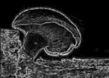
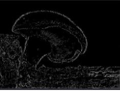

# Canny Edge Detection

**Process**

1. Given a Random Image

2. Convert the image to grayscale with `cvtColor()` of opencv

3. Apply a Gaussian filter with a 5x5 kernel and $\sigma=1.5$

4. Equalize the image with the function `equalizeHist` of opencv

5. Apply the Sobel border detection, you will get the image $G$, and the border angles $\theta$

6. Apply the Canny Edge Detection and apply the threshold to get the final borders.

