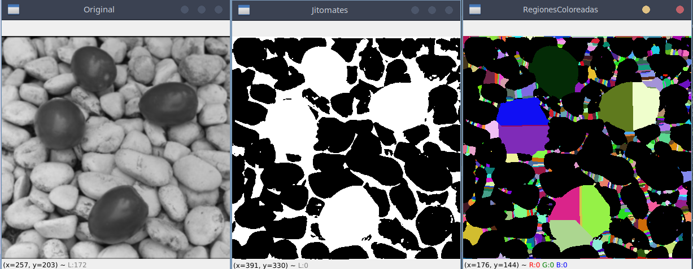
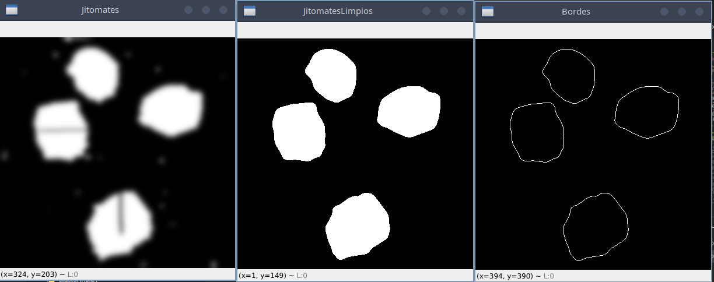
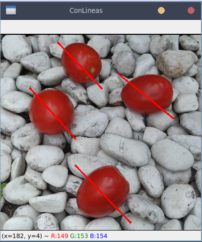

# Examen 2 Castro Mendieta Fernando 5BV1 

Preprocesamiento de la imagen y segmentación básica

Detección de bordes de los objetos más grandes 

Segmentación de objetos usando K-Means

Obtención de las distancias y medida de las diagonales de cada objeto. 

