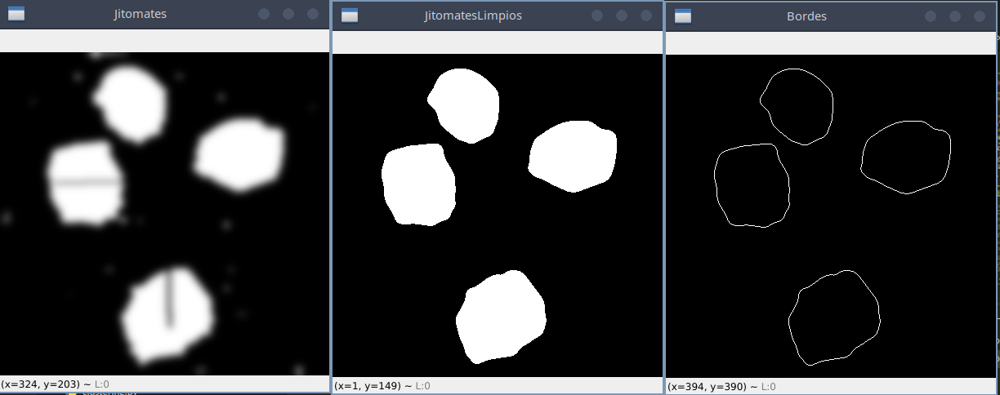
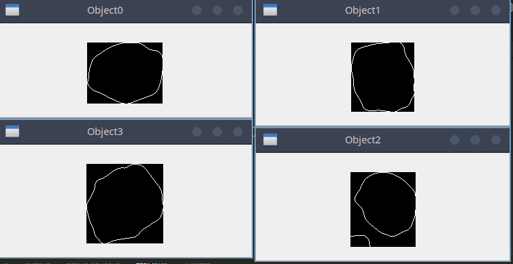
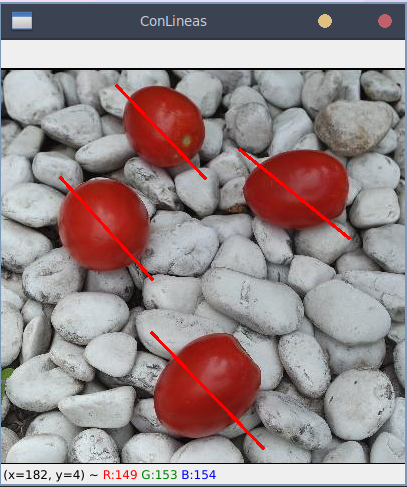

# Image Object Segmentation

**Process**

Given an image with 4 tomatoes in, we need to extract the bounding boxes of them.

Preprocessing, Threesholding and Watershed segmentation.


Once finished the watershed segmentation, we take the bigger regions, apply blur, threeshold and Laplacian Border detection with isodata threeshold.



Use kmeans to get the centers of the tomatoes.



And finally measure the diagonal of the tomatoes. 



**How do use it?**

```sh
python examen2.py jitomates.jpg
...
Tus objetos de interés son oscuros : 1 : si, 0 : no => 1
...
Ingresa el número de regiones que ocupan tus objetos : 8
...
¿Cuántos objetos hay en la imagen?4
```